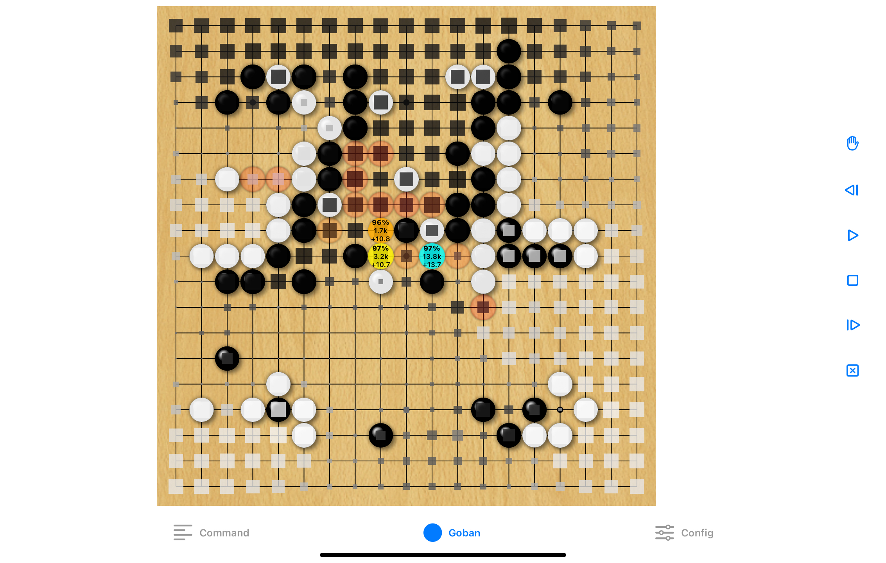
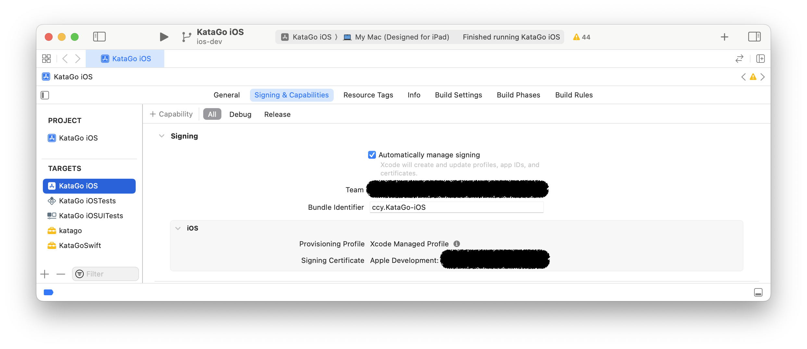
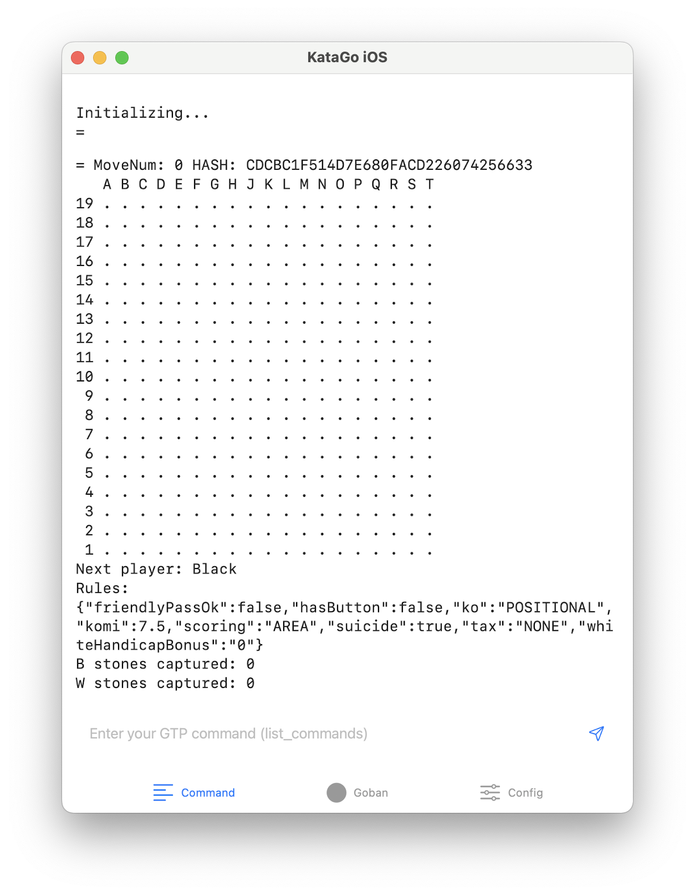
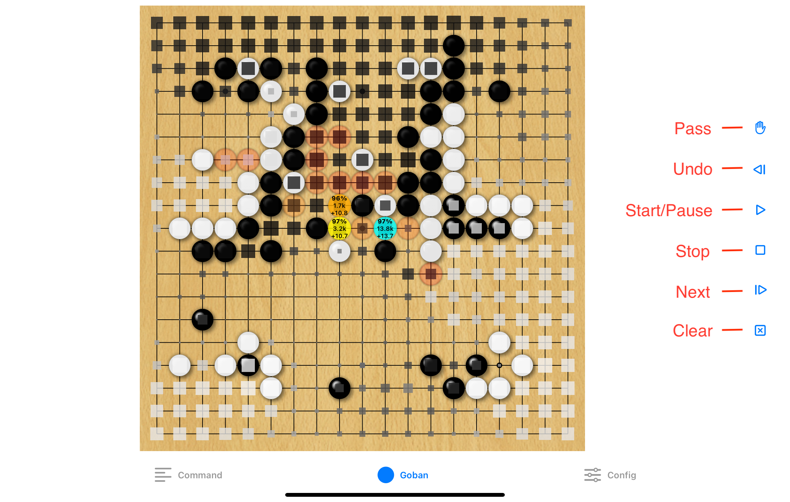
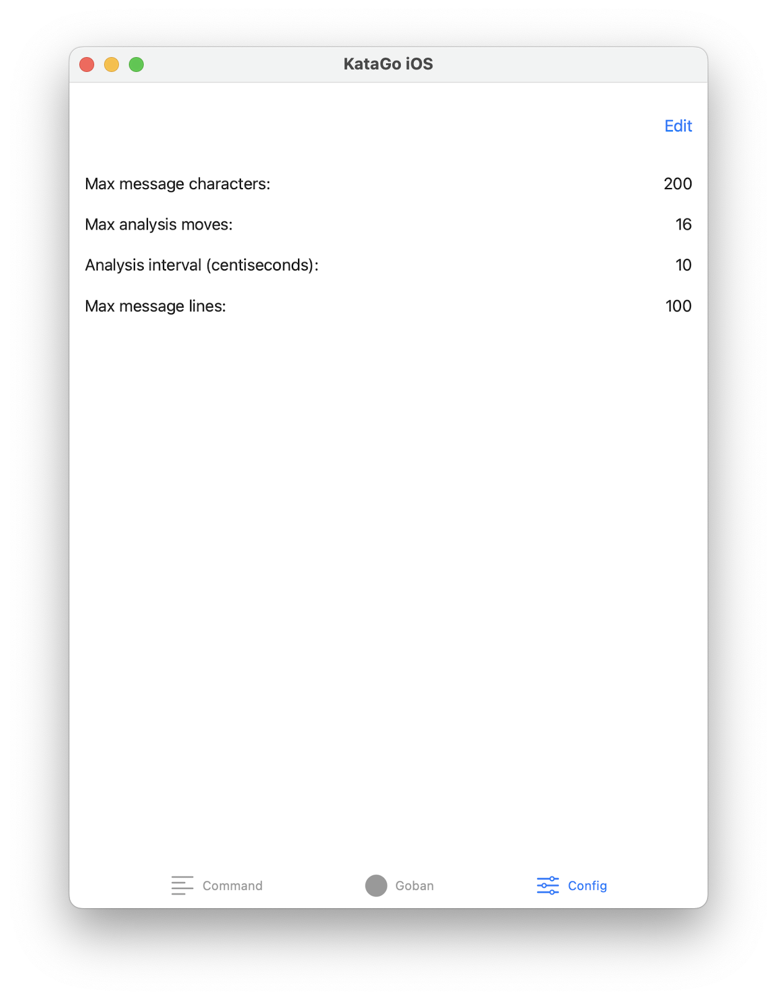

# Documentation for KataGo iOS project

## Overview
The *KataGo iOS* project serves as an interface layer, integrating the [KataGo](https://github.com/ChinChangYang/KataGo/tree/metal-coreml-stable) engine with Apple's [iOS](https://www.apple.com/ios) platform to provide a user-friendly graphical interface. Utilizing [SwiftUI](https://developer.apple.com/xcode/swiftui/), this interface allows users to interact with the KataGo engine through [GTP](https://github.com/ChinChangYang/KataGo/blob/metal-coreml-stable/docs/GTP_Extensions.md) commands and visually engage with the Go board. The project leverages the [CoreML backend](https://github.com/ChinChangYang/KataGo/blob/metal-coreml-stable/docs/CoreML_Backend.md) to harness the computational power of Apple's [Neural Engine](https://machinelearning.apple.com/research/neural-engine-transformers) (NE) and GPU, optimizing for power efficiency and performance.



## CoreML Integration and Power Efficiency
This project employs the [CoreML](https://developer.apple.com/machine-learning/core-ml/) framework through the [`MLModel`](https://developer.apple.com/documentation/coreml/mlmodel) API, enabling KataGo inference with a [CoreML model](https://apple.github.io/coremltools/docs-guides/source/overview-coremltools.html) converted from the KataGo network. This integration is pivotal for leveraging the Neural Engine in Apple silicon, known for its superior power efficiency compared to traditional GPU processing. The decision to limit search threads to two is a strategic optimization to balance minimal power consumption with responsive user interaction, particularly crucial for mobile devices where battery efficiency is paramount.

## Analysis of Benchmark Results
Rigorous benchmarking conducted on contemporary devices, including the [iPhone 12](https://support.apple.com/kb/SP830) and [iPad mini (6th generation)](https://support.apple.com/kb/SP850), has elucidated the CoreML Neural Engine (NE) backend's superior power efficiency relative to traditional GPU processing alternatives. These findings are instrumental in demonstrating the Neural Engine's capacity to handle computationally demanding tasks, such as Go game analysis, while adhering to the stringent power consumption constraints inherent to mobile devices.

### Benchmark Analysis for iPhone 12

- **Specifications**: Equipped with Apple's A14 Bionic chip, featuring a 6-core CPU, 4-core GPU, and a 16-core Neural Engine.
- **KataGo Version**: `v1.14.0-coreml1`
- **Neural Network Model**: `b18c384nbt`
- **Concurrency**: Limited to 2 search threads to optimize power efficiency.

#### Benchmark Table for iPhone 12

```
| Backend    | Visits/s | NnEvals/s | Power/5m    |
|------------|----------|-----------|-------------|
| CoreML NE  | 68.91    | 57.80     | 66% -> 61%  |
| CoreML GPU | 10.37    | 8.84      | 74% -> 67%  |
| Metal GPU  | 17.64    | 14.79     | 67% -> 62%  |
```

The CoreML NE backend demonstrates a significant efficiency advantage, achieving higher visit and evaluation rates while consuming less power, a testament to the Neural Engine's optimization for Go game analysis.

### Benchmark Analysis for iPad mini (6th generation)

- **Specifications**: Powered by the A15 Bionic chip with a 6-core CPU, 5-core GPU, and a 16-core Neural Engine.
- **KataGo Version**: `v1.14.0-coreml1`
- **Neural Network Model**: `b18c384nbt`
- **Concurrency**: Maintained at 2 search threads to ensure power efficiency.

#### Benchmark Table for iPad mini (6th generation)

```
| Backend    | Visits/s | NnEvals/s | Power/5m    |
|------------|----------|-----------|-------------|
| CoreML NE  | 79.42    | 66.83     | 57% -> 54%  |
| CoreML GPU | 17.06    | 14.44     | 63% -> 60%  |
| Metal GPU  | 31.27    | 26.61     | 66% -> 63%  |
```

On the iPad mini (6th generation), the CoreML NE backend not only sustains its lead in processing efficiency but also showcases an enhanced power-saving profile, further reinforcing the Neural Engine's role in optimizing *KataGo iOS* applications for mobile platforms.

## Source Code Compilation Guidelines
The setup process for the *KataGo iOS* project involves a series of steps designed to prepare your development environment, clone the project repository, and configure necessary resources. Follow these detailed guidelines to ensure a smooth setup and compilation process.

### Cloning the Project Repository
To commence the setup, initiate by cloning the designated branch, `ios-dev`, from the repository maintained by `ChinChangYang`, into a directory named `KataGo-ios-dev`:
```
git clone https://github.com/ChinChangYang/KataGo.git -b ios-dev KataGo-ios-dev
```

Transition into the directory specific to the *KataGo iOS* project:
```
cd KataGo-ios-dev/ios/KataGo\ iOS
```

### Acquiring Necessary Resources
Proceed to acquire the KataGo network file, placing it within the `Resource` directory:
```
wget https://github.com/ChinChangYang/KataGo/releases/download/v1.13.2-coreml2/kata1-b18c384nbt-s8341979392-d3881113763.bin.gz -O Resources/default_model.bin.gz
```

Furthermore, download the compressed [CoreML](https://github.com/ChinChangYang/KataGo/releases/tag/v1.13.2-coreml2) model from the specified release and store it within the same directory:
```
wget https://github.com/ChinChangYang/KataGo/releases/download/v1.13.2-coreml2/KataGoModel29x29fp16v14s8341979392.mlpackage.zip -O Resources/KataGoModel29x29fp16.mlpackage.zip
```

Subsequently, decompress the CoreML model file:
```
unzip Resources/KataGoModel29x29fp16.mlpackage.zip -d Resources
```

Rename the decompressed model to match the expected name in the `KataGo iOS` project:
```
mv Resources/KataGoModel29x29fp16v14s8341979392.mlpackage Resources/KataGoModel29x29fp16.mlpackage
```

### Configuring the Project in Xcode
Open the project file within [Xcode](https://developer.apple.com/xcode/), Apple's integrated development environment (IDE), by executing the following command:
```
open KataGo\ iOS.xcodeproj
```

Configure the code signing settings within Xcode by navigating to the project's "Signing & Capabilities" section. This involves selecting an appropriate code signing identity and development team, typically linked to an Apple Development certificate and a unique Team ID registered with the Apple Developer Program.

Refer to the provided screenshot for guidance on configuring the code signing settings in Xcode:



### Building and Running the Application
Finalize the setup by building and running the application. This can be achieved by selecting "Product -> Run" from the Xcode menu or using the `Command + r` shortcut. This initiates the build process and launches the application on the chosen simulator or connected device, ensuring the project is correctly set up and ready for development and testing.

## User Guide
This guide will walk you through the application's primary functionalities, ensuring a seamless user experience.

### Navigating the Interface
#### Command Tab
Upon launching the KataGo iOS application, you'll be greeted with the **Command** tab. This section serves as a command center, allowing you to input specific [GTP commands](https://github.com/ChinChangYang/KataGo/blob/metal-coreml-stable/docs/GTP_Extensions.md) to interact with the KataGo engine. Commands like `kgs-rules japanese` and `komi 6.5` can be entered here to customize your game settings.



#### Goban Tab
Switch to the **Goban** tab to access the visual heart of your Go experience. Here, a graphical game board awaits your moves, displaying KataGo's real-time analysis and suggestions. The toolbar integrated within this tab offers quick-access buttons for comprehensive game control:

- **Pass**: Skip your turn without making a move.
- **Undo**: Revert the last action taken.
- **Start/Pause**: Begin or pause KataGo's analytical process.
- **Stop**: Cease analysis and conceal the results.
- **Next**: Generate the next move.
- **Clear**: Remove all stones from the board, resetting the game.



#### Config Tab
For a tailored application experience, the **Config** tab allows you to adjust various settings. Here, you can define the visibility and frequency of in-game messages and analysis, optimizing the application to suit your preferences.



Within the **Config** tab, you can adjust the following parameters to enhance your gameplay:

- **Max Message Characters**: Sets the limit for the number of characters displayed from the GTP command outputs.
- **Max Analysis Moves**: Determines the maximum number of moves KataGo will analyze.
- **Analysis Interval (Centiseconds)**: Specifies the frequency, in centiseconds, at which KataGo updates its analysis.
- **Max Message Lines**: Caps the number of lines shown from the GTP command outputs.
